# World of History Museum Website

### Table of Contents
- [Overview](#overview)
- [Features](#features)
- [User Experience UX](#user-experience-ux)
- [Wireframes](#wireframes)
- [Design](#design)
- [Technologies Used](#technologies-used)
- [File Structure](#file-structure)
- [Deployment](#deployment)
- [Testing and Bugs](#testing-and-bugs)
  - [Manual Testing](#manual-testing)
  - [Lighthouse Testing](#lighthouse-testing)
  - [HTML and CSS Validation](#html-and-css-validation)
- [Attributions](#attributions)
- [Additional Notes](#additional-notes)
- [Author](#author)

---

# Overview

A website for the **World of History Museum**, designed to showcase the exhibits on offer and the oppurtunity to engage with the museum through the various forms on offer. This website is for families, students and history enthuisast who are interested in what the museum has on offer.

It allowsfor users to know what they can excpect and plan their visit around what they want to see.

---

# Features

* **Home Page Carousel** showcasing museum visuals
* **Visit Page** including ticket purchase, registration, newsletter
* **Responsive Design** with Bootstrap 5
* **Contact and Newsletter forms**
* **Video integration** in exhibits

---

# User Experience UX

## Project Goals

* Provide an intuitive and visually appealing interface
* Make exhibit content available for planning
* Encourage engagement via sign ups and bookings

## User Stories

### First Time Users
* I want an engaging homepage introducing the museum
* I want clear navigation to exhibits and visit information

### Returning Users
* I want fast access to ticket booking and new events

### Frequent Users
* I want to subscribe to newsletters and receve updates

---

## Responsive Design Preview

Below is a multi device mockup demonstrating how the **World of History Museum** website appears on desktop laptop tablet and mobile screens and screeenshots.
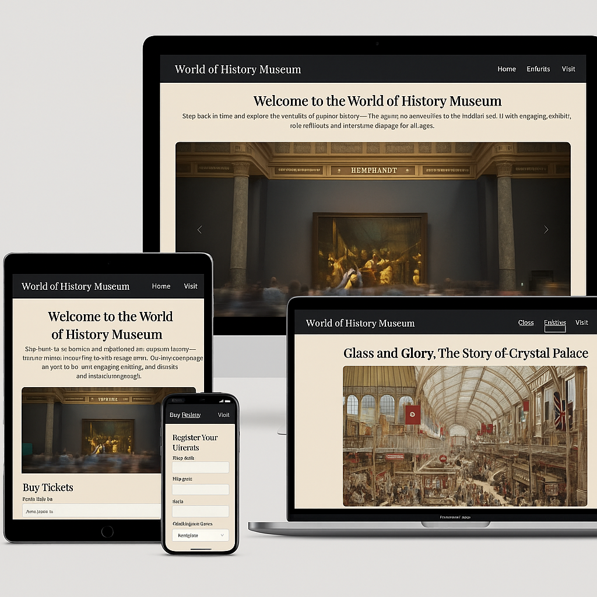 

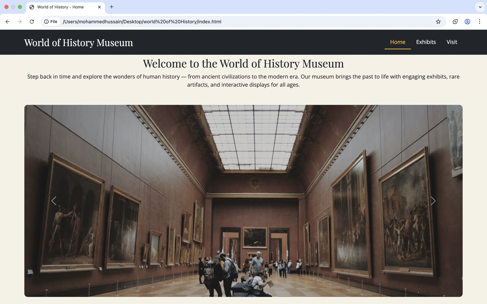 

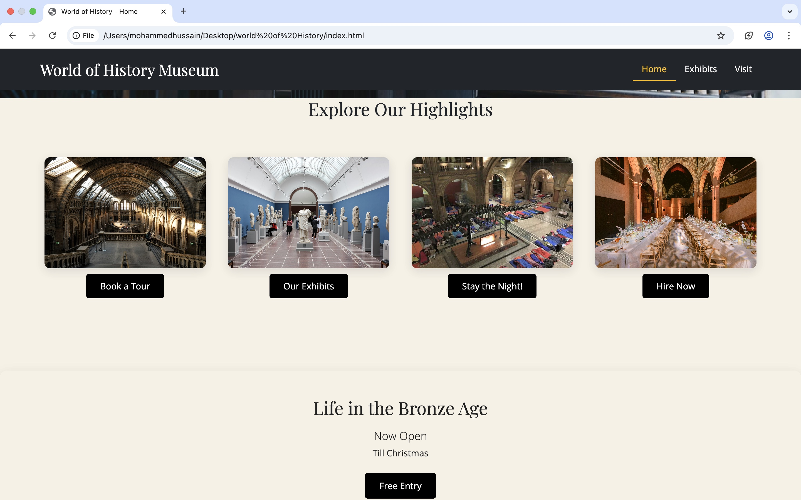

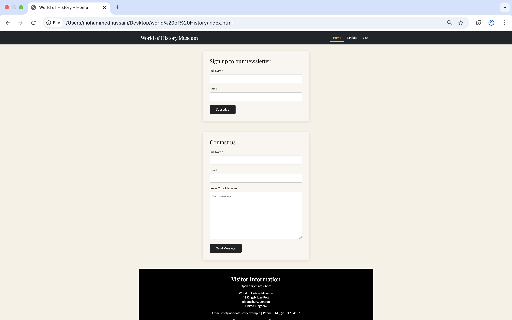

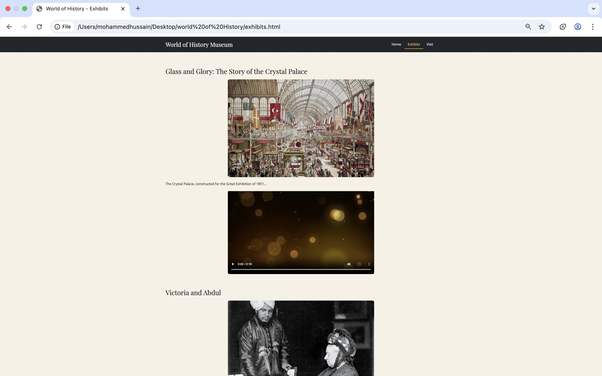

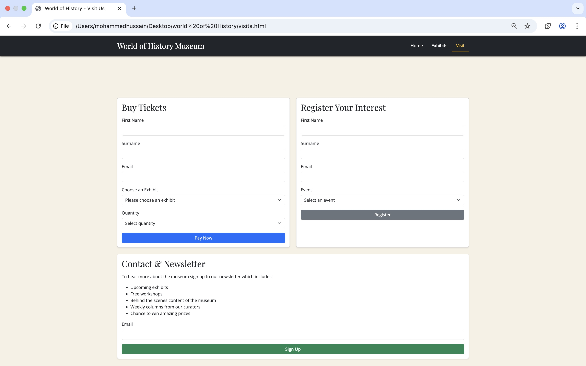

---

# Design

## Colour Scheme

* Background `#f5f1e6`
* Header and Footer `#212529`
* Highlight `#ffc107`

## Typography

* Open Sans for body text
* Playfair Display for headings and titles

## Imagery

High quality curated images including Unsplash Wikimedia Commons museum inspired assets and exhibit specific photography.

---

# Wireframes

Wireframe link  
https://balsamiq.cloud/sucgt7o/phmvnkl

Desktop layouts use a full width carousel  
Tablet layouts use adjusted padding  
Mobile layouts use a single column layout

---

# Technologies Used

## Languages
* HTML
* CSS
* JavaScript Bootstrap bundle

## Frameworks and Libraries
* Bootstrap 5.3
* Google Fonts

## Tools
* GitHub
* VS Code
* Chrome DevTools
* Lighthouse
* Balsamiq
* W3C Validator
* MDN
* Chat GPT

---

# File Structure
# File Structure

World-Of-History  
│  
├── index.html  
├── exhibits.html  
├── visits.html  
│  
├── assets  
│   ├── style.css  
│   ├── exhibits.css  
│   ├── visits.css  
│   │  
│   ├── media  
│   │   │ 
│   │   │   ├── crystalpalace.jpg  
│   │   │   ├── victoriaandabdul.jpg  
│   │   │   ├── mummy.jpeg  
│   │   │   ├── pyramids.jpeg  
│   │   │   ├── tudors1.jpg  
│   │   │   ├── henry-new.jpeg.webp  
│   │   │   ├── roman-warrior.jpeg.avif  
│   │   │   ├── roman-enemy.jpeg.avif  
│   │   │   ├── greek-new.jpeg.avif  
│   │   │   └── plato-new.jpeg.avif  
│   │   │  
│   │   ├── videos  
│   │   │   ├── clip-one.mp4  
│   │   │   ├── egyptian.mp4  
│   │   │   └── romans.mp4  
│   │  
│   ├── lighthouse.jpeg  
│   ├── multi-screen.jpeg.png  
│   ├── validator-index.jpeg  
│   ├── validator-visit.jpeg  
│   └── validator-exhibit.jpeg  
│  
└── README.md

---

# Deployment

### Local Development Environment

The project was developed locally using VS Code. A new project folder was created and opened in VS Code. All HTML CSS image and video assets were created and organised within this folder.

During development each page was tested locally in the browser to check layout navigation and responsivness.

---

### Version Control Using Git

Git was used for version control to track progress. Files were staged and committed regularly after key changes were made.

---

### Creating the GitHub Repository

A repository named World Of History was created on GitHub and the local project was connected to it. Files were pushed using the main branch.

---

### Deployment Using GitHub Pages

GitHub Pages was enabled through repository settings. The main branch and root folder were selected. GitHub then generated a live link.

---

### Updating the Live Site

Any new commits pushed to the main branch automatically update the live website.

---

### Live Website

https://msadekhussain2001-ux.github.io/World-Of-History/

---

# Testing and Bugs

|# Testing and Bugs

| Bug | Description | Expected Result | Actual Result | Status |
|-----|------------|----------------|--------------|--------|
| 1 | Navbar not collapsing on mobile | Collapses correctly | Stayed expanded | Fixed |
| 2 | Gallery image broken | Image loads | Broken link | Fixed |
| 3 | Form not submitting | Form sends | No action | Fixed |
| 4 | Cards misaligned on tablet | Proper grid | Overlap | Fixed |
| 5 | Footer alignment issue | Footer stays at bottom | Misaligned | Unresolved |
| 6 | Hover colour incorrect | Gold hover | Grey hover | Fixed |
| 7 | CSS not updating | Updated styles load | Browser cached | Fixed |
| 8 | Video not responsive | Scales correctly | Overflowing | Fixed |
| 9 | Anchor links misaligned | Correct scroll | Offset slightly | Fixed |
| 10 | Carousel not autoplaying | Rotates slides | Stuck on first slide | Fixed |
| 11 | Mobile padding inconsistent | Even spacing | Too tight | Fixed |
| 12 | Hero image pixelated | Sharp image | Blurry | Fixed |

---

## Manual Testing

Manual tests were carried out on navigation buttons links and forms to ensure expected behaviour for a static front end project. 
## Manual Testing

Manual tests were carried out on all interactive elements across the site to ensure correct navigation and expected behaviour for a static front end project.

### Button and Link Functionality

| Item Tested | Page | Expected Result | Actual Result | Pass |
|------------|------|-----------------|---------------|------|
| Home navigation | All pages | Loads index page | Works correctly | Yes |
| Exhibits navigation | All pages | Loads exhibits page | Works correctly | Yes |
| Visit navigation | All pages | Loads visits page | Works correctly | Yes |
| Carousel next button | Home | Moves to next slide | Works correctly | Yes |
| Carousel previous button | Home | Moves to previous slide | Works correctly | Yes |
| Book a tour button | Home | Opens visits page | Works correctly | Yes |
| Our exhibits button | Home | Opens visits page | Works correctly | Yes |
| Footer social links | All pages | Opens external site | Works correctly | Yes |

### Forms Testing

| Form | Page | Expected Behaviour | Result | Pass |
|------|------|-------------------|--------|------|
| Newsletter signup | Home | Accepts email input | Works | Yes |
| Contact form | Home | Accepts text input | Works | Yes |
| Buy tickets form | Visit | Accepts selections | Works | Yes |
| Register interest form | Visit | Accepts text input | Works | Yes |

---

# Lighthouse Testing

Lighthouse testing was carried out using Chrome DevTools. 
# Lighthouse Testing

Lighthouse testing was carried out using Chrome DevTools to assess performance accessibility best practices and SEO.

| Category | Result |
|--------|--------|
| Performance | Passed |
| Accessibility | Minor warnings |
| Best Practices | Passed |
| SEO | Passed |

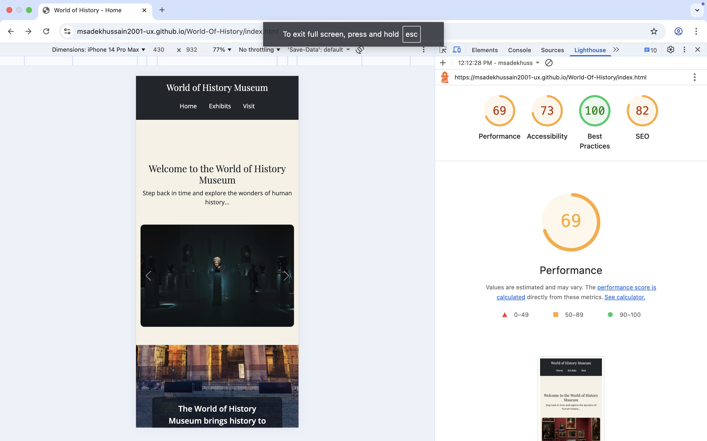

---

# HTML and CSS Validation

HTML and CSS were validated using the W3C Validator. All CSS files passed validation. HTML errors were related to button placement and missing alt attributes.

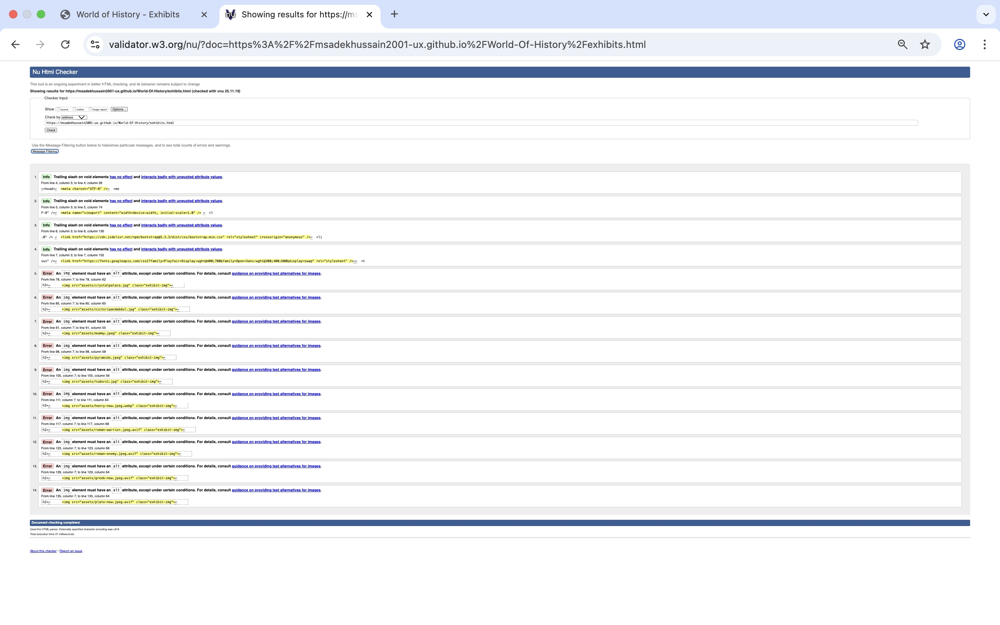
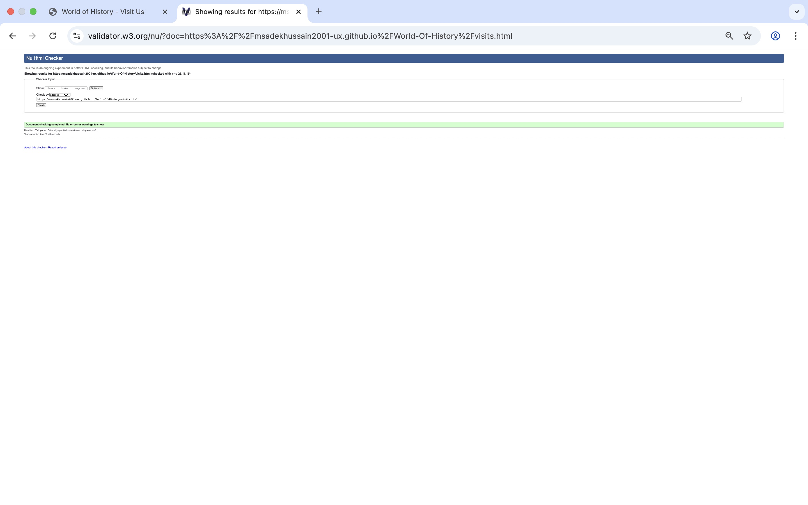
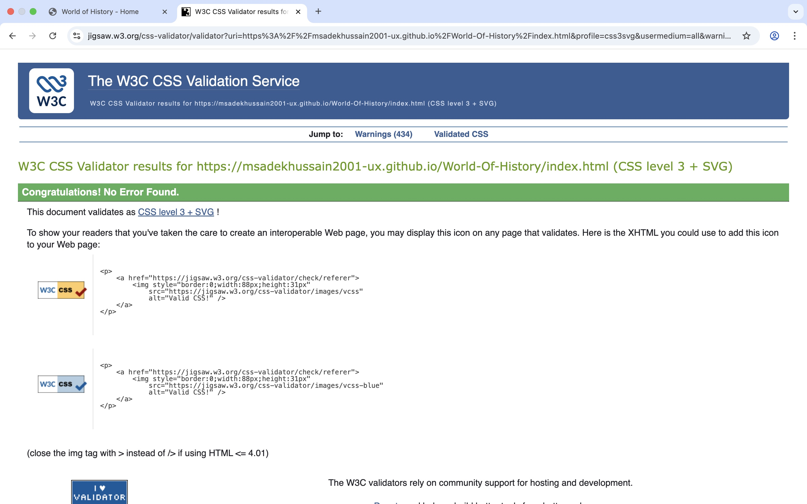
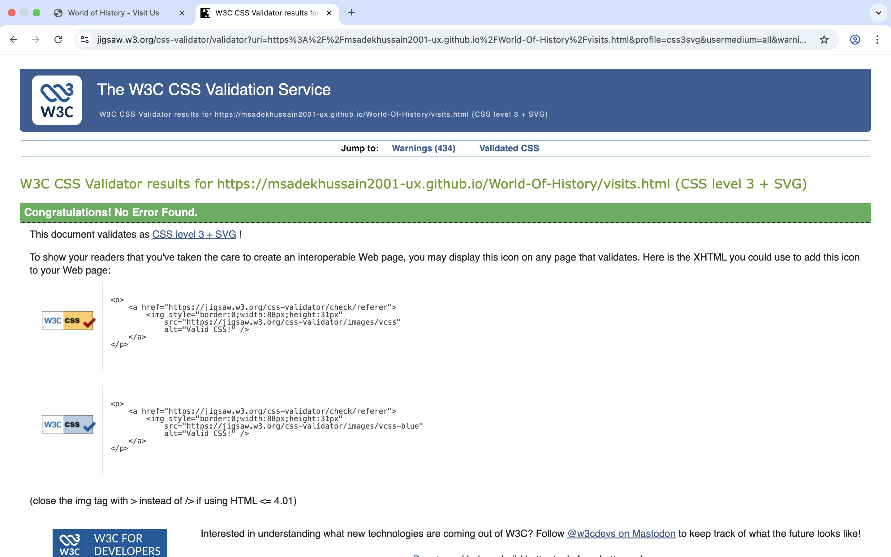
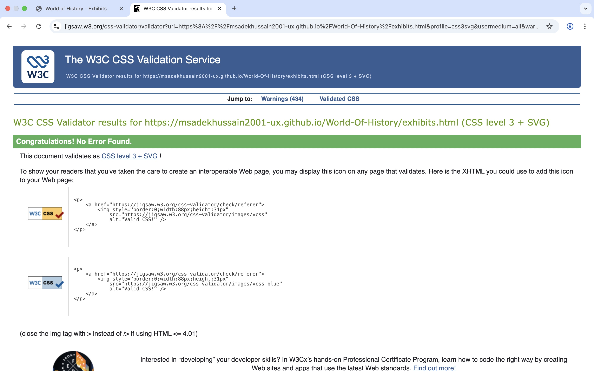

### HTML Validation Results

| Page | Result |
|-----|--------|
| index.html | Errors related to button placement |
| exhibits.html | Missing alt attributes |
| visits.html | No errors |

### CSS Validation Results

| File | Result |
|-----|--------|
| style.css | No errors |
| exhibits.css | No errors |
| visits.css | No errors |

---

# Attributions

Images videos and design inspiration were sourced from Unsplash Wikimedia Commons museum websites and educational resources.

---

# Additional Notes

This project was inspired by modern museum websites.  
Manual debugging and some AI assistance were used during development.

---

# Author

Mohammed Sadek Hussain  
NCC  
Level 5 Web Development  
Milestone 1

